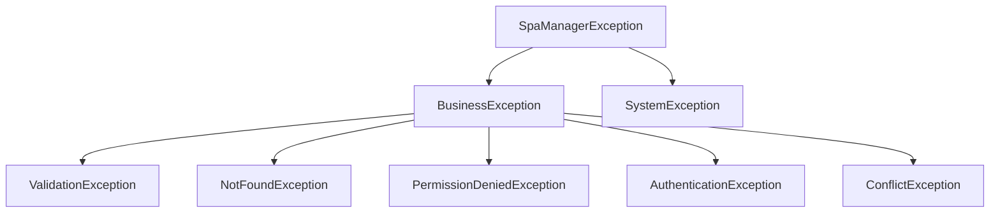

# Error Handling Guidelines – SpaManager

Tài liệu này đặc tả cơ chế xử lý lỗi (Exception Handling) chuẩn hóa toàn cục áp dụng cho tất cả các module nghiệp vụ trong SpaManager.

---

## 1. Exception Hierarchy (Hệ thống phân cấp Exception)

Tất cả các exception nghiệp vụ bắt buộc phải kế thừa từ lớp cha `SpaManagerException` đặt trong `core/exceptions.py`.



### Danh sách các Exception & Phạm vi áp dụng:

1. **`BusinessException`** (Base của các lỗi nghiệp vụ, mặc định: HTTP 400, Severity: WARNING)
   * Sử dụng làm base cho mọi lỗi liên quan đến logic kinh doanh mà hệ thống có thể lường trước được.

2. **`ValidationException`** (HTTP 400, Severity: WARNING)
   * **Khi nào dùng**: Kiểm tra tính hợp lệ của dữ liệu đầu vào.
   * **Ví dụ**: Số điện thoại sai định dạng, họ tên khách hàng bị bỏ trống, giá trị thanh toán âm.
   * **Đặc trưng**: Không ghi nhận vào ActivityLog để tránh gây nhiễu nhật ký.

3. **`NotFoundException`** (HTTP 404, Severity: WARNING)
   * **Khi nào dùng**: Không tìm thấy bản ghi/thực thể trong cơ sở dữ liệu.
   * **Ví dụ**: Xem chi tiết hóa đơn không tồn tại, sửa thông tin dịch vụ đã bị xóa vĩnh viễn.

4. **`PermissionDeniedException`** (HTTP 403, Severity: ERROR)
   * **Khi nào dùng**: Người dùng cố tình truy cập tài nguyên ngoài phạm vi phân quyền.

5. **`AuthenticationException`** (HTTP 401, Severity: WARNING)
   * **Khi nào dùng**: Phiên làm việc hết hạn hoặc thông tin đăng nhập không hợp lệ.

6. **`ConflictException`** (HTTP 409, Severity: WARNING)
   * **Khi nào dùng**: Trùng lặp dữ liệu duy nhất hoặc vi phạm quy tắc toàn vẹn dữ liệu.
   * **Ví dụ**: Đăng ký số điện thoại khách hàng đã tồn tại, xóa dịch vụ đã phát sinh hóa đơn liên kết.

7. **`SystemException`** (HTTP 500, Severity: CRITICAL)
   * **Khi nào dùng**: Sự cố hệ thống nghiêm trọng, lỗi cơ sở dữ liệu, lỗi mất kết nối máy chủ ngoài tầm kiểm soát.

---

## 2. Error Code Guidelines (Quy tắc đặt Mã lỗi)

Không sử dụng các chuỗi thông báo lỗi tự do (hard-coded string) để phân loại lỗi ở máy chủ. Mỗi Exception bắt buộc gán một `code` duy nhất:

* **`VALIDATION_ERROR`**: Dữ liệu gửi lên không đúng định dạng hoặc thiếu trường bắt buộc.
* **`NOT_FOUND`**: Không tìm thấy tài nguyên yêu cầu.
* **`PERMISSION_DENIED`**: Không có quyền thực hiện hành động.
* **`AUTHENTICATION_FAILED`**: Đăng nhập thất bại hoặc chưa xác thực.
* **`CONFLICT`**: Trùng lặp dữ liệu hoặc vi phạm ràng buộc khóa ngoại.
* **`SYSTEM_ERROR`**: Lỗi hệ thống hoặc lỗi cơ sở dữ liệu nghiêm trọng.

---

## 3. Quy trình xử lý lỗi của dự án (Error Flow Lifecycle)

### A. Tầng Service (Service Layer)
* **Quy tắc**: Chỉ kiểm tra dữ liệu và trực tiếp `raise Exception` phù hợp.
* **Cấm**: Không được gọi `flash()`, `redirect()`, hoặc trả về `False` để báo lỗi.
```python
# Hợp lệ
if not service:
    raise NotFoundException("Không tìm thấy dịch vụ!")

# Cấm
if not service:
    return False  # Cấm dùng return False báo lỗi
```

### B. Tầng Route (Route Layer)
* **Đối với yêu cầu HTML thông thường**:
  Sử dụng khối `try...except BusinessException` để xử lý cục bộ và chuyển hướng người dùng về trang cụ thể, kèm thông báo flash.
```python
@service_bp.route('/services/create', methods=['POST'])
def create():
    try:
        ServiceService.create_service(request.form.to_dict())
        NotificationService.flash_success('Thêm thành công!')
        return redirect(url_for('service.index'))
    except BusinessException as e:
        NotificationService.flash_error(e.message)
        return redirect(url_for('service.create'))
```
* **Đối với yêu cầu AJAX (JSON)**:
  Để các exception tự động nổi lên (raise) mà không cần viết khối `try...except` cục bộ. Trình xử lý lỗi toàn cục (`ErrorHandler`) sẽ tự động bắt lấy, ánh xạ mã trạng thái HTTP, ghi log và trả về cấu trúc JSON đồng nhất:
```json
{
  "success": false,
  "code": "VALIDATION_ERROR",
  "message": "Tên dịch vụ không được để trống."
}
```

---

## 4. Ghi Nhật ký lỗi (Logging & ActivityLog Rules)

1. **Ghi log ra file**:
   * Mọi exception đều được ghi tự động vào `logs/application.log`.
   * Các lỗi nghiêm trọng có `severity` là `ERROR` hoặc `CRITICAL` sẽ được ghi riêng biệt vào `logs/error.log` kèm thông tin Traceback đầy đủ phục vụ cho debug.

2. **Ghi log vào Database (Activity Log)**:
   * Chỉ ghi nhận các lỗi thuộc loại `WARNING`, `ERROR`, hoặc `CRITICAL`.
   * **Bỏ qua**: Các lỗi `VALIDATION_ERROR` thông thường để tránh làm tràn ngập bảng nhật ký hoạt động.

---

## 5. Quy tắc chung cho Lập trình viên

> [!CAUTION]
> * **Không sử dụng khối catch trần (`except:`)**: Luôn luôn bắt cụ thể loại exception (ví dụ: `except BusinessException as e` hoặc `except Exception as e`).
> * **Không log thông tin nhạy cảm**: Tuyệt đối không lưu mật khẩu hoặc token gốc vào log file hoặc ActivityLog.
