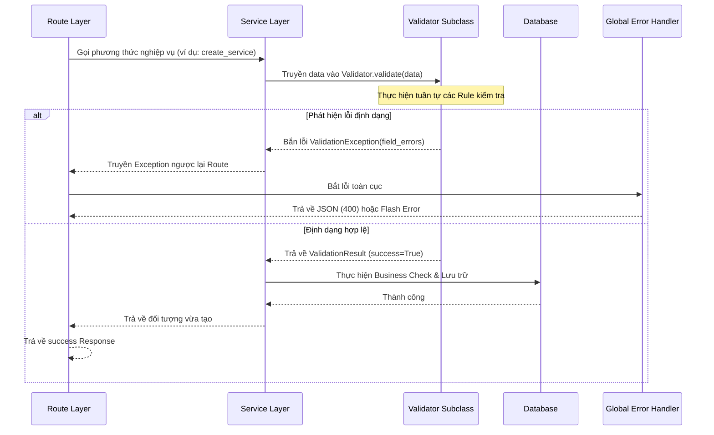

# Khung Xác Thực Dữ Liệu Nhất Quán (Unified Validation Framework)

Tài liệu này giải thích chi tiết về kiến trúc, luồng hoạt động và cách mở rộng Khung Xác Thực Dữ Liệu (Validation Framework) trong SpaManager.

---

## 1. Tổng Quan Kiến Trúc

Để khắc phục tình trạng validation rải rác ở nhiều lớp (Route, Service, JS, HTML), SpaManager áp dụng một **Khung Validation Nhất Quán** nằm hoàn toàn trong thư mục `validators/`.

```text
validators/
├── rules/                    # Các hàm kiểm tra độc lập (Input Validation)
│   ├── __init__.py
│   ├── required.py
│   ├── email.py
│   ├── phone.py
│   ├── number.py
│   ├── length.py
│   ├── regex.py
│   └── date.py
│
├── __init__.py               # Export các lớp và hàm validator
├── base_validator.py         # Lớp cơ sở BaseValidator
├── result.py                 # DTO lưu trữ kết quả ValidationResult
├── messages.py               # Namespace quản lý thông báo lỗi tập trung
│
├── customer_validator.py     # Validator cho Khách hàng
├── service_validator.py      # Validator cho Dịch vụ
├── appointment_validator.py  # Validator cho Lịch hẹn (bao gồm DB check)
├── invoice_validator.py      # Validator cho Hóa đơn
├── auth_validator.py         # Validator cho Auth (Đăng nhập, Đổi mật khẩu)
├── backup_validator.py       # Validator cho Sao lưu
├── import_validator.py       # Validator cho Nhập khẩu Excel
└── profile_validator.py      # Validator cho Hồ sơ cá nhân
```

### Nguyên tắc thiết kế:
1. **Phân tách trách nhiệm**:
   - **Input Validation** (Kiểm tra định dạng, rỗng, độ dài...): Thực hiện bởi các Validator kế thừa từ `BaseValidator`.
   - **Business Validation** (Kiểm tra trùng lặp DB, xung đột trùng giờ...): Thực hiện bởi Service Layer sau khi Input Validation thành công.
2. **Không Validate trong Route**: Route chỉ đóng vai trò nhận dữ liệu, gọi Service (hoặc Validator), và trả về Response (HTML/JSON).
3. **Sử dụng Exception để điều hướng**: Mọi lỗi validation từ Validator đều bắn ra `ValidationException` (chứa mapping chi tiết `field_errors`). Hệ thống Exception Handler toàn cục sẽ tự động bắt và trả về JSON cho AJAX hoặc flash message cho HTML.

---

## 2. Luồng Hoạt Động (Validation Flow)



---

## 3. Cách Viết Một Rule Mới (`validators/rules/`)

Mỗi Rule là một hàm Python độc lập nhận vào giá trị cần kiểm tra và các tham số bổ sung. Rule phải trả về `True` nếu hợp lệ, và `False` nếu không hợp lệ.

### Ví dụ: Định nghĩa `validators/rules/email.py`
```python
import re

def validate_email(value):
    if not value:
        return True  # Cho phép giá trị rỗng nếu trường này không bắt buộc
    pattern = r'^[a-zA-Z0-9._%+-]+@[a-zA-Z0-9.-]+\.[a-zA-Z]{2,}$'
    return re.match(pattern, str(value).strip()) is not None
```

*Đừng quên đăng ký rule mới vào `validators/rules/__init__.py` để dễ dàng import.*

---

## 4. Cách Viết Một Validator Mới

Mọi Validator phải kế thừa từ `BaseValidator` và ghi đè phương thức `validate(self, data)`.

### Ví dụ: `validators/service_validator.py`
```python
from validators.base_validator import BaseValidator
from validators.messages import ValidationMessages
from validators.rules import validate_required, validate_number

class ServiceValidator(BaseValidator):
    def validate(self, data):
        self.result.field_errors.clear()
        self.result.success = True
        
        name = data.get('name', '')
        price = data.get('price', '')
        
        # 1. Tên bắt buộc nhập
        if not validate_required(name):
            self.add_error('name', ValidationMessages.REQUIRED)
            
        # 2. Đơn giá phải lớn hơn hoặc bằng 0
        if not validate_required(price):
            self.add_error('price', ValidationMessages.REQUIRED)
        elif not validate_number(price, min_val=0):
            self.add_error('price', "Đơn giá dịch vụ phải là số không âm.")
            
        return self.result
```

---

## 5. Tích Hợp Vào Service Layer

Validator nên được khởi tạo và chạy ngay tại dòng đầu tiên của phương thức Service để đảm bảo dữ liệu đầu vào luôn sạch trước khi xử lý logic nghiệp vụ.

```python
from validators.service_validator import ServiceValidator
from core.exceptions import NotFoundException

class ServiceService:
    @staticmethod
    def create_service(data):
        # 1. Chạy Validator
        validator = ServiceValidator()
        validator.validate(data)
        validator.raise_if_invalid("Thông tin dịch vụ không hợp lệ.") # Bắn ValidationException nếu có lỗi
        
        # 2. Xử lý logic nghiệp vụ
        new_service = Service(
            name=data.get('name').strip(),
            price=float(data.get('price'))
        )
        db.session.add(new_service)
        db.session.commit()
        return new_service
```

---

## 6. Xử Lý Lỗi Ở Route Layer (HTML vs AJAX)

Hệ thống xử lý lỗi `core/error_handler.py` sẽ bắt các lỗi `ValidationException` và định dạng phản hồi phù hợp:
- **AJAX (JSON)**: Trả về HTTP Code `400` kèm JSON chứa `field_errors` để hiển thị trực tiếp lỗi dưới từng ô input của form.
- **HTML (Redirect/Flash)**: Tự động gom lỗi thành Flash Message dạng Toast để cảnh báo người dùng.

### Ví dụ xử lý AJAX ở Client:
```javascript
fetch('/appointments/create', {
    method: 'POST',
    headers: { 'Content-Type': 'application/json' },
    body: JSON.stringify(formData)
})
.then(async response => {
    const data = await response.json();
    if (!response.ok) {
        if (data.field_errors) {
            // Render lỗi dưới từng input tương ứng
            Object.keys(data.field_errors).forEach(field => {
                showFieldError(field, data.field_errors[field]);
            });
        } else {
            Notification.error(data.message || 'Có lỗi xảy ra');
        }
    } else {
        window.location.href = data.redirect;
    }
});
```
