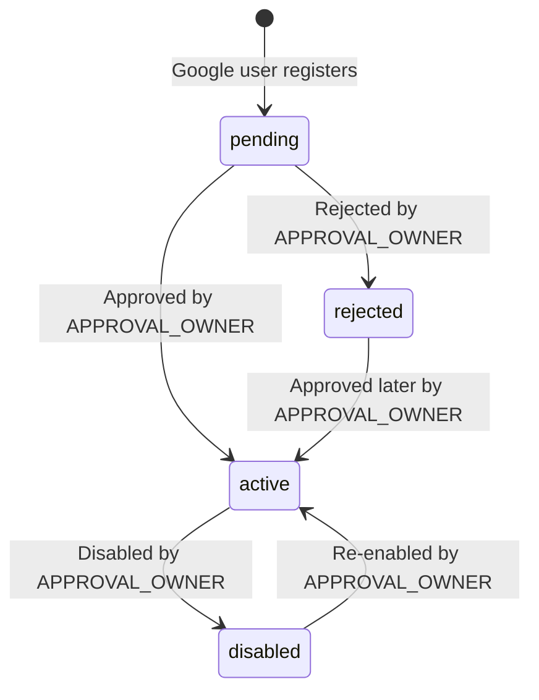

# Workspace Approval Portal Account Management

This document details the account approval and management lifecycle within the `SpaManager` Approval Portal.

## Purpose

The Approval Portal is an isolated portal built specifically for the `APPROVAL_OWNER` user role. It allows the administrator to review, approve, reject, disable, or re-enable users across the application. It acts as the gateway to user provisioning and system security.

## User Account Status Lifecycle

User accounts transition through the following states:

### Status Descriptions

1. **pending**:
   - Initial state of newly registered Google users.
   - `is_active` is `False`.
   - Cannot access the main application dashboard or workspace assets.
   - Shown in the **Chờ duyệt** tab.

2. **active (approved)**:
   - User is allowed full access to the application.
   - `is_active` is `True`.
   - Google owner accounts are automatically provisioned with a dedicated workspace and owner membership.
   - Shown in the **Đã duyệt** (Hoạt động) tab, grouped by ownership/workspace.

3. **rejected**:
   - Registration request is declined.
   - `is_active` is `False`.
   - Access to the application is blocked.
   - Accounts are preserved in the system and shown in the **Từ chối** tab.

4. **disabled**:
   - Accounts that were active but are now locked/deactivated.
   - `is_active` is `False`.
   - Cannot log in.
   - All workspace memberships associated with the user are marked as `inactive` to secure the workspaces.
   - Shown in the **Vô hiệu hóa** tab.

---

## Allowed Actions by APPROVAL_OWNER

The `APPROVAL_OWNER` can perform the following actions:
- **Duyệt (Approve)** pending users.
- **Từ chối (Reject)** pending users.
- **Duyệt lại (Approve again)** rejected users.
- **Vô hiệu hóa (Disable)** active users (excluding other `APPROVAL_OWNER` users).
- **Kích hoạt lại (Re-enable)** disabled users.

---

## Application and Approval Portal Separation

- **No overlap**: The Approval Portal is entirely distinct from the main SpaManager business workspace.
- **Access control**:
   - `OWNER`, `ADMIN`, and `STAFF` roles are completely blocked from accessing `/approval/*` endpoints (returns `403 Forbidden`).
   - `APPROVAL_OWNER` is completely blocked from accessing main workspace pages (redirected back to `/approval/accounts`).

---

## Login and Status Pages Behavior

When users log in with restricted status:
- **Session-Based Status Routing**: All users whose status is not active (`can_access_app == False`) are routed to `/auth/pending` dynamically. The status template is chosen based on their actual database `approval_status`.
- **Status Page Templates**:
  - **pending**: Renders `templates/auth/pending.html` with title "Tài khoản chờ duyệt" and body text informing the user that their account is awaiting approval.
  - **rejected**: Renders `templates/auth/account_status.html` with title "Tài khoản đã bị từ chối" and body: `"Tài khoản Google này đã bị từ chối. Vui lòng liên hệ quản trị duyệt tài khoản nếu cần xem xét lại."`.
  - **disabled**: Renders `templates/auth/account_status.html` with title "Tài khoản đã bị vô hiệu hóa" and body: `"Tài khoản của bạn đã bị vô hiệu hóa. Vui lòng liên hệ quản trị."`.
- **Interaction Constraints**: No warning login toast is shown. They cannot bypass the status page or enter the app. A **Đăng xuất / Quay lại đăng nhập** button is provided to cleanly clear the session and return to the login page.

---

## Approved Accounts Grouping

Under the **Đã duyệt** tab, accounts are clearly grouped for readability:
- **Nhóm 1: Chủ spa / tài khoản đăng ký**: Google OAuth registered users with the role `OWNER`. Displays their workspace name.
- **Nhóm 2: Nhân viên/quản lý do Chủ spa tạo**: Local/invited accounts with the role `ADMIN` or `STAFF` created by owners. These are grouped by workspace name, showing the workspace owner's name and username.
- **Exclude APPROVAL_OWNER**: All users with the `APPROVAL_OWNER` role are strictly filtered out and hidden from all tables and groups in the portal.

---

## Workspace Provisioning Idempotency

When a Google user is approved or re-enabled:
- If they do not have a workspace, a new workspace and active `owner` membership are provisioned automatically.
- If they already have an existing workspace membership (even if it was marked `inactive`), it is updated back to `active` (and mapped to `owner` role) without creating any duplicate workspaces or memberships.

---

## Non-Goals
- No self-service user appeal page within the app.
- No option to permanently delete a user from the Approval Portal database.
- No database migrations are introduced or run for this feature.

---

## Manual QA Checklist

1. [ ] Log in as `APPROVAL_OWNER`. Go to `/approval/accounts`.
2. [ ] Verify tabs show lists for "Chờ duyệt", "Đã duyệt", "Từ chối", "Vô hiệu hóa".
3. [ ] Verify active users are separated into "Nhóm 1" (Chủ spa) and "Nhóm 2" (Nhân viên, grouped by workspace).
4. [ ] Click "Duyệt" on a pending user. Verify they move to "Đã duyệt" tab.
5. [ ] Click "Vô hiệu hóa" on an active user. Verify they move to "Vô hiệu hóa" tab.
6. [ ] Try to log in as the disabled user. Verify they are redirected to `/auth/pending` rendering the "Tài khoản đã bị vô hiệu hóa" page.
7. [ ] Try to log in as a rejected user. Verify they are redirected to `/auth/pending` rendering the "Tài khoản đã bị từ chối" page.
8. [ ] Click "Đăng xuất" on status pages. Verify session is cleared and redirects to `/login` without errors.
9. [ ] Attempt to access `/approval/accounts` as an `OWNER` or `STAFF` user. Verify `403` error.
