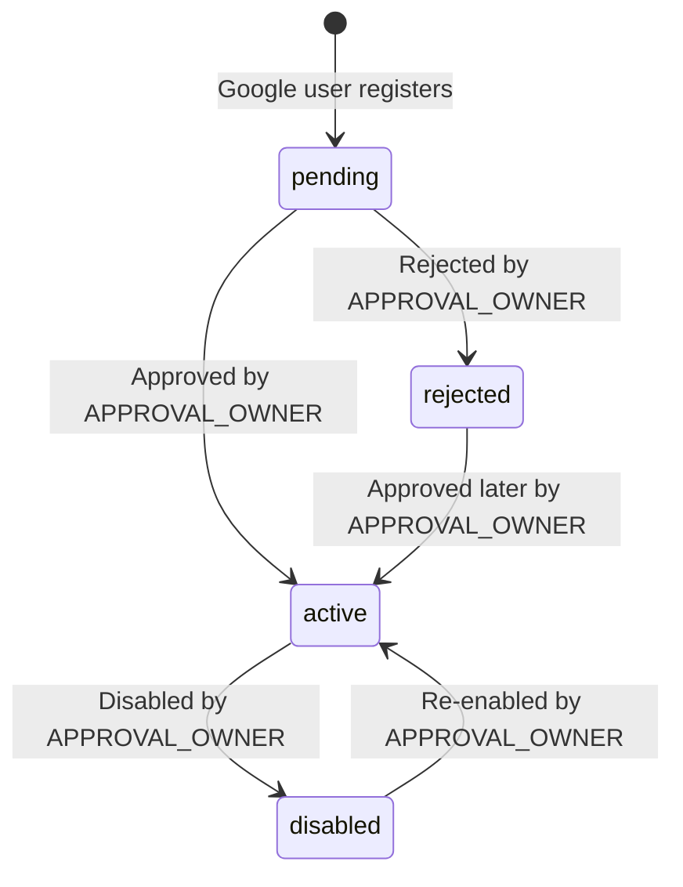

# Workspace Approval Portal Account Management

This document details the account approval and management lifecycle within the `SpaManager` Approval Portal.

## Purpose

The Approval Portal is an isolated portal built specifically for the `APPROVAL_OWNER` user role. It allows the administrator to review, approve, reject, disable, or re-enable users across the application. It acts as the gateway to user provisioning and system security.

## User Account Status Lifecycle

User accounts transition through the following states:

### Status Descriptions

1. **pending**:
   - Initial state of newly registered Google users.
   - `is_active` is `False`.
   - Cannot access the main application dashboard or workspace assets.
   - Shown in the **Chờ duyệt** tab.

2. **active (approved)**:
   - User is allowed full access to the application.
   - `is_active` is `True`.
   - Google owner accounts are automatically provisioned with a dedicated workspace and owner membership.
   - Shown in the **Đã duyệt** tab.

3. **rejected**:
   - Registration request is declined.
   - `is_active` is `False`.
   - Access to the application is blocked.
   - Accounts are preserved in the system and shown in the **Từ chối** tab for auditing and potential future activation.

4. **disabled**:
   - Accounts that were active but are now locked/deactivated.
   - `is_active` is `False`.
   - Cannot log in.
   - All workspace memberships associated with the user are marked as `inactive` to secure the workspaces.
   - Shown in the **Vô hiệu hóa** tab.

---

## Allowed Actions by APPROVAL_OWNER

The `APPROVAL_OWNER` can perform the following actions:
- **Duyệt (Approve)** pending users.
- **Từ chối (Reject)** pending users.
- **Duyệt lại (Approve again)** rejected users.
- **Vô hiệu hóa (Disable)** active users (excluding other `APPROVAL_OWNER` users).
- **Kích hoạt lại (Re-enable)** disabled users.

---

## Application and Approval Portal Separation

- **No overlap**: The Approval Portal is entirely distinct from the main SpaManager business workspace.
- **Access control**:
  - `OWNER`, `ADMIN`, and `STAFF` roles are completely blocked from accessing `/approval/*` endpoints (returns `403 Forbidden`).
  - `APPROVAL_OWNER` is completely blocked from accessing main workspace pages (redirected back to `/approval/pending` or `/approval/accounts`).

---

## Login Behavior by Status

When users log in:
- **pending**: Redirected to `/auth/pending` with a notice that their account is pending approval.
- **rejected**: Blocked from logging in. Shows a single error message: `"Tài khoản Google này đã bị từ chối. Vui lòng liên hệ quản trị duyệt tài khoản."` (for Google users) or `"Tài khoản của bạn đã bị từ chối. Vui lòng liên hệ quản trị."` (for local users).
- **disabled**: Blocked from logging in. Shows a single error message: `"Tài khoản của bạn đã bị vô hiệu hóa. Vui lòng liên hệ quản trị."`.

---

## Workspace Provisioning Idempotency

When a Google user is approved or re-enabled:
- If they do not have a workspace, a new workspace and active `owner` membership are provisioned automatically.
- If they already have an existing workspace membership (even if it was marked `inactive`), it is updated back to `active` (and mapped to `owner` role) without creating any duplicate workspaces or memberships.

---

## Non-Goals
- No self-service user appeal page within the app.
- No option to permanently delete a user from the Approval Portal database.
- No database migrations are introduced or run for this feature.

---

## Manual QA Checklist

1. [ ] Log in as `APPROVAL_OWNER`. Go to `/approval/accounts`.
2. [ ] Verify tabs show lists for "Chờ duyệt", "Đã duyệt", "Từ chối", "Vô hiệu hóa".
3. [ ] Click "Duyệt" on a pending user. Verify they move to "Đã duyệt" tab.
4. [ ] Click "Vô hiệu hóa" on an active user. Verify they move to "Vô hiệu hóa" tab.
5. [ ] Try to log in as the disabled user. Verify rejection message is displayed.
6. [ ] Click "Kích hoạt lại" on the disabled user. Verify they move back to "Đã duyệt" tab and can log in successfully.
7. [ ] Attempt to access `/approval/accounts` as an `OWNER` or `STAFF` user. Verify `403` error.
